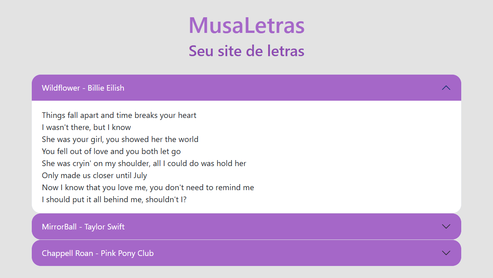

# Estudo Bootstrap

Este repositório contém meus códigos de estudo para o framework **Bootstrap**. A ideia é organizar e acompanhar o progresso dos conceitos e componentes que estou aprendendo e implementando.

## Sumário

- [Accordion](#accordion)
- [Modal](#modal)
- [Formulário](#formulario)
- [Botões](#botoes)
- [Navbar](#navbar)
- [Grid System](#grid-system)

## Progresso

- 🟢 Concluído
- 🔴 Em progresso
- ⚪ Não iniciado

---

## Accordion

🟢 **Concluído**

Aqui está o código do meu estudo sobre o componente **Accordion** do Bootstrap. Com isso, aprendi a criar seções que podem ser expandidas ou contraídas.

[Ver código do Accordion]([./accordion](https://github.com/tifanisds/estudo-bootstrap/tree/master/accordion))

---

## Modal

🔴 **Em progresso**

Estou atualmente trabalhando no componente **Modal**, que permite criar caixas de diálogo interativas.

[Ver código do Modal](./modal)

---

## Formulário

⚪ **Não iniciado**

A próxima etapa será o estudo de formulários, onde vou implementar campos de entrada, seleções, botões de envio, etc., utilizando o Bootstrap.

---

## Botões

⚪ **Não iniciado**

Em breve, começarei a estudar os diferentes tipos de botões no Bootstrap e como personalizá-los.

---

## Navbar

⚪ **Não iniciado**

Vou aprender a criar barras de navegação responsivas e interativas, utilizando o sistema de grid do Bootstrap.

---

## Grid System

⚪ **Não iniciado**

A última parte será estudar o sistema de grid do Bootstrap, que permite criar layouts responsivos.

---
